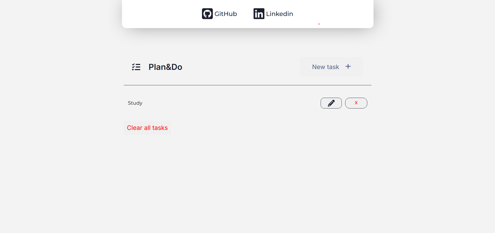

# Plan&Do




## Languages

- [Português](#português)
- [English](#english)

## Português

Plan&Do é uma aplicação web simples e intuitiva para gerenciamento de tarefas, desenvolvida com HTML, SASS e JavaScript puro. Ideal para quem busca praticidade na organização do dia a dia.​

## Links

- [Live Demo](joeljr27.github.io/Plan-Do)

- [Repositório GitHub](github.com/JoelJR27/Plan-Do)

## Funcionalidades

- Adição de novas tarefas com um clique.​

- Edição e exclusão de tarefas existentes.​

- Interface limpa e responsiva.​

- Aplicação do CRUD (Create, Read, Update, Delete).

## Tecnologias Utilizadas

- HTML5​
- SASS
- JavaScript

## Como Executar Localmente

1. Clone o repositório:​

    ```bash
        git clone https://github.com/JoelJR27/Plan-Do.git

2. Navegue até o diretório do projeto:​

    ```bash
        cd Plan-Do 

3. Abra o arquivo *index.html* em seu navegador preferido.​

## Observações

O projeto é totalmente funcional sem a necessidade de servidores ou dependências externas.​

Para modificar os estilos, edite o arquivo ***styles.scss*** e compile-o para ***styles.css***.​

___
___

## English

Plan&Do is a simple and intuitive web application for task management, built with HTML, SASS, and pure JavaScript. Perfect for those looking for a practical way to organize their daily tasks.

## Features

- Add new tasks with a single click.

- Edit and delete existing tasks.

- Clean and responsive interface.

- Full CRUD functionality (Create, Read, Update, Delete).

## Technologies Used

- HTML5
- SASS
- JavaScript

## How to Run Locally

1. Clone the repository:

    ```bash
        git clone https://github.com/JoelJR27/Plan-Do.git

2. Navigate to the project directory:

    ```bash
        cd Plan-Do

3. Open the index.html file in your preferred browser.

### Notes

The project is fully functional without any server or external dependencies.

To modify the styles, edit the ***styles.scss*** file and compile it to ***styles.css***.
